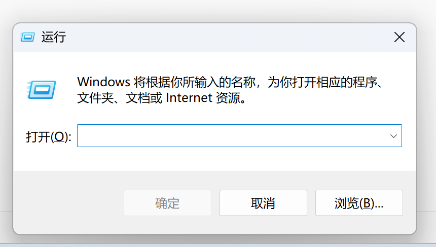
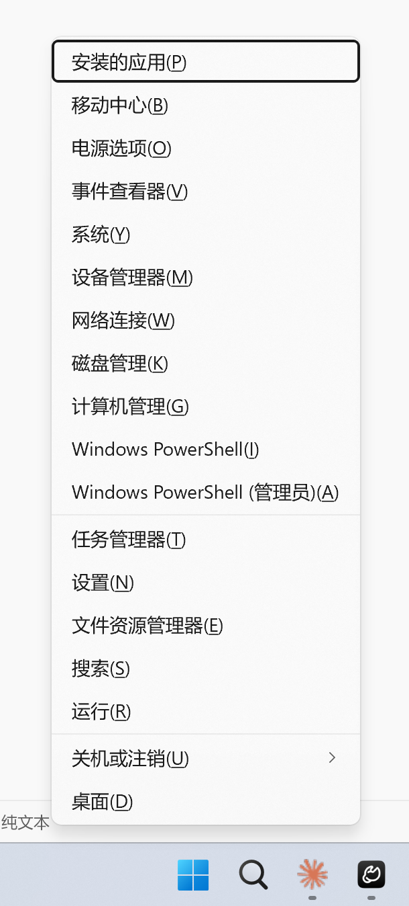
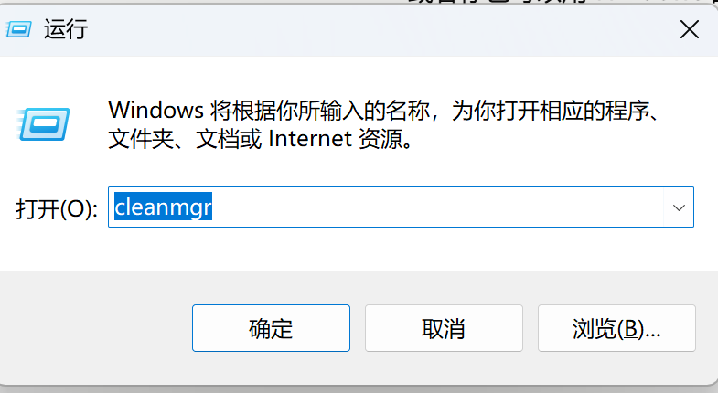
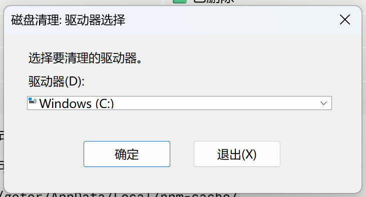
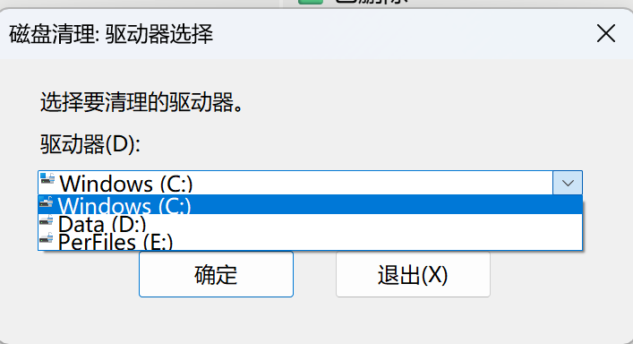
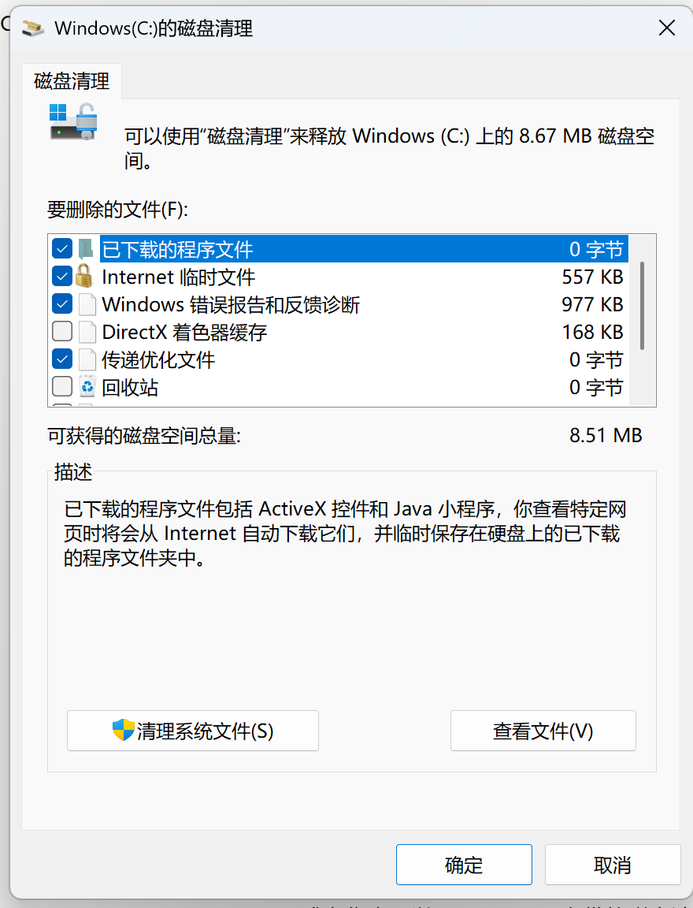
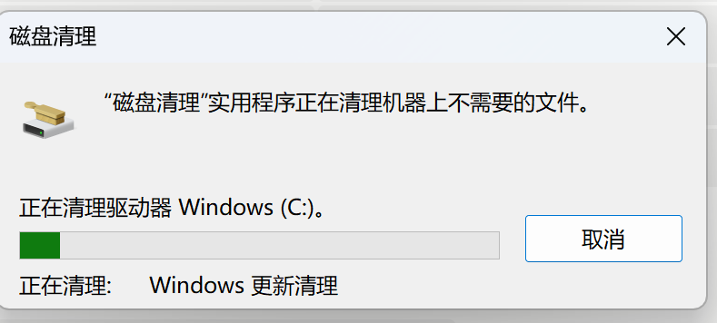

<p align="center">
  
  
  
  
</p>

# pc-ops

> **个人电脑运维实战手册 — 磁盘、安全、权限、快捷键、清理，每项一个独立模块，拿来即用。**

---

## 五大模块

```
         你的电脑
            |
   ┌────────┼────────┬────────┬────────┐
   ▼        ▼        ▼        ▼        ▼
 磁盘空间  安全认证  系统清理  效率提升  权限审计
   │        │        │        │        │
   ▼        ▼        ▼        ▼        ▼
 分区合并  Token/SSH  磁盘清理  快捷键   SID清理
 (物理)    (配置)    (软件)    (键盘)   (审计)
```

---

## ⌨️ Windows 快捷键

> **记住一个快捷键 = 每天省 30 秒 x 365 天 = 3 小时/年。记住 10 个 = 每年省 30 小时。**

### 🎯 你最常用的 4 个

#### Win + R — 万能运行入口



按下后直接输入程序名或命令，秒开一切：

| 输入 | 打开 |
|------|------|
| `cmd` | 命令提示符 |
| `powershell` | PowerShell |
| `control` | 控制面板 |
| `calc` | 计算器 |
| `services.msc` | 服务管理器 |
| `devmgmt.msc` | 设备管理器 |
| `cleanmgr` | 磁盘清理 |

#### Win + X — 系统工具箱



右键开始按钮也能打开。一键直达 15+ 系统工具：PowerShell（管理员）、设备管理器、磁盘管理、事件查看器、任务管理器、网络连接、系统信息……

#### Win + Shift + S — 截屏 / 录屏

| 操作 | 效果 |
|------|------|
| 拖拽鼠标 | 选择矩形区域截图 |
| 点击窗口 | 自动识别截取窗口 |
| 截图后自动进剪贴板 | 直接 Ctrl+V 粘贴到任意应用 |
| 点击通知弹窗 | 进入「截图与草图」标注（箭头、文字、马赛克） |

> 💡 Win11 新版支持长按后选择「屏幕录制」模式。

#### Win + Shift + T — OCR 提取文字

屏幕上任意位置的文字（图片、PDF、视频字幕、禁止复制的网页）→ 框选 → 自动识别 → 进剪贴板 → Ctrl+V 粘贴。

> ⚠️ 需要 Windows 11 22H2+

### ⚡ 每天必用的 5 个

| 快捷键 | 功能 | 场景 |
|--------|------|------|
| **Win + D** | 显示/隐藏桌面 | 秒回桌面，再按恢复所有窗口 |
| **Win + L** | 锁定电脑 | 离开工位必按 |
| **Win + E** | 打开资源管理器 | 找文件 |
| **Win + ↑/↓/←/→** | 窗口最大化/最小化/左右半屏 | 分屏对比、拖文件 |
| **Alt + Tab** | 快速切换窗口 | 在多应用间跳转 |

### 🔧 开发 & 高级用户

| 快捷键 | 功能 |
|--------|------|
| **Ctrl + Shift + Esc** | 直接打开任务管理器（比 Ctrl+Alt+Del 快） |
| **Win + V** | 剪贴板历史（云同步，看最近复制过什么） |
| **Win + I** | Windows 设置 |
| **Win + Ctrl + D** | 创建新虚拟桌面（工作/生活/娱乐分开） |
| **Win + ;（分号）** | emoji 表情面板 😊 |

### 🔥 常用组合技

```
C盘红了       → Win+R → cleanmgr → 磁盘清理
怀疑中毒     → Ctrl+Shift+Esc → 看进程
截图发群里   → Win+Shift+S → 选区域 → Ctrl+V 粘贴
找设置       → Win+I → 直接搜
多任务       → Win+Ctrl+D → 新桌面 → Win+Ctrl+←→ 切换
离开工位     → Win+L → 锁屏
```

---

| 文档 | 内容 |
|------|------|
| [📘 完整 50+ 快捷键手册](windows-shortcuts/windows-shortcuts-skill.md) | 系统基础 + 窗口管理 + 文件管理 + 浏览器 + 记忆金字塔 + 常见误区 |

---

## 🧹 Windows 自带磁盘清理

> **C 盘红了但不想动分区？用系统自带工具，安全清出 5~30 GB。**

### 为什么大多数人清完 C 盘还是红的？

网上 99% 的教程只说「勾选全部 → 确定」。但**「清理系统文件」按钮才是关键**——不点它，Windows 更新缓存（5~30 GB）和 Windows.old（10~30 GB）根本不会出现。

### 操作流程（5 步截图）



**Step 1**：`Win + R → cleanmgr → 选 C 盘 → 确定` — 此时只有回收站、临时文件等零头。



**Step 2**：点击「清理系统文件」← **关键一步！** 需要管理员权限确认。



**Step 3**：此时出现 Windows 更新清理（5~30 GB）、以前的 Windows 安装（10~30 GB）等大头。



**Step 4**：勾选 → 确定 → 开始清理。Dism 后台清理 WinSxS 旧组件。



**Step 5**：一键脚本代替手动操作：

```batch
:: 管理员 CMD 中运行
cleanmgr /sagerun:1
Dism /online /Cleanup-Image /StartComponentCleanup /Quiet
```

> ⚠️ 需先跑一次 `cleanmgr /sageset:1` 保存配置。

### 安全原则速查

```
✅ 放心清   回收站、临时文件、缩略图、错误报告、传递优化
⚠️ 注意     Windows 更新清理（不可卸载更新）、驱动程序包（保留最新）
⚠️ 慎清      以前的 Windows 安装（确认新系统稳定）、系统还原点（保留最近一个）
❌ 别干      手动删 WinSxS 文件夹、用第三方工具清注册表
```

| 文档 | 内容 |
|------|------|
| [📘 完整操作指南](windows-disk-cleanup/windows-disk-cleanup-skill.md) | 13 项逐条拆解 + CLI 自动化 + 三套脚本 + FAQ |

---

## 🗂️ 磁盘分区合并

> **C 盘满了，旁边有个废盘 — 物理扩容，一劳永逸。**

| 维度 | 说明 |
|------|------|
| **解决问题** | C 盘空间不足，有废弃分区可删除，释放空间合并到 C 盘 |
| **涉及什么** | 删除分区 → 拖拽移动分区 → 扩展 C 盘 → 恢复 BitLocker 加密 |
| **风险等级** | 🔴 高 — 分区操作不可逆，数据丢失不可恢复 |
| **工具** | AOMEI Partition Assistant（免费）、Windows diskpart / manage-bde |

```
扩容前  [C: 195GB ████████░░░░░░░░]
扩容后  [C: 368GB ████████████████░]
```

**一句话**：这是物理扩容——真的动了磁盘分区表。和上面磁盘清理是互补关系：先清理，不够再扩容。


| 文档 | 内容 |
|------|------|
| [📘 全流程操作指南](disk-partition-merge/F盘空间合并至C盘操作全流程指南.md) | 每步带截图 |
| [📄 技能参考](disk-partition-merge/disk-partition-merge-bitlocker-skill.md) | PowerShell 命令 + 故障排查 |

---

## 🔐 Token & SSH 安全认证

> **在聊天框里粘贴 Token？等你看到这条的时候，它可能已经泄露了。**

| 方案 | 凭证经过对话文本？ | 安全等级 | 适用场景 |
|------|:---:|:---:|------|
| GitHub SSH | ❌ 不经过 | 🟢 极低风险 | Git push/pull（首选） |
| ClawHub OAuth | ❌ 不经过 | 🟢 低风险 | Skill 发布（首选） |
| Fine-Grained PAT | ⚠️ 经过但可限制 | 🟡 中风险 | API 调用、兜底方案 |

> **核心原则**：Token 要经过对话文本才能给 AI = 不安全。SSH 私钥不出本地、OAuth 走浏览器授权 = Token 从不出现。后者永远优先。

| 文档 | 内容 |
|------|------|
| [📄 Token & SSH 安全认证](token-security/token-ssh-auth.md) | 泄露检测 + SSH 四步 + OAuth 三步 + AI 指令模板 |

---

## 🔍 清除残留 SID 账户

> **文件夹属性里有个「未知账户 (S-1-5-21-xxx)」删不掉？系统重装留下的孤儿 SID。**

```
识别 SID → 全盘扫描（文件系统+注册表+任务计划+服务） → 逐项清除 → 验证
```


| 文档 | 内容 |
|------|------|
| [📘 操作指南](sid-cleanup/清除残留SID账户操作指南.md) | PowerShell 命令 + 实战案例 |

---

## 🔀 什么时候用哪个？

```
C盘红了 ──┬── 先跑「磁盘清理」清缓存 → 还是不够 → 再跑「分区合并」物理扩容
           └── 两者互补，不是二选一

快捷键   ──── 效率模块。学几个常用的，剩下的需要时查表。

安全认证 ──── 独立模块。跟磁盘没关系，但每个用 AI 写代码的人都该配置。

SID残留 ──── 独立模块。系统重装后按需运行。
```

---

## 📁 仓库结构

```
pc-ops/
├── README.md
├── windows-shortcuts/          ← 快捷键速查
│   ├── windows-shortcuts-skill.md
│   └── win-*.png (2 张截图)
├── windows-disk-cleanup/       ← 软件清理
│   ├── README.md
│   ├── windows-disk-cleanup-skill.md
│   └── 1-5.png (操作截图)
├── disk-partition-merge/       ← 物理扩容
│   ├── README.md
│   ├── F盘空间合并至C盘操作全流程指南.md
│   ├── disk-partition-merge-bitlocker-skill.md
│   └── aomei-*.png (截图)
├── token-security/             ← 认证安全
│   └── token-ssh-auth.md
└── sid-cleanup/                ← 权限审计
    ├── README.md
    ├── 清除残留SID账户操作指南.md
    └── sid-permission-example.png
```

---

## 🚀 快速开始

```bash
git clone https://github.com/web-seeker/pc-ops.git
```

**建议顺序**：磁盘清理 →（不够？）→ 分区合并 → 顺手配 SSH → 学几个快捷键 → windows-shortcuts

> 哪天发现「未知账户」→ SID 清理

> ⚠️ 磁盘和权限操作有不可逆风险。操作前完整阅读对应模块的免责声明。

---

## 📄 License

MIT · 所有步骤已实际操作验证 · 2026.06

<p align="center">
  <sub>Made with ❤️ by <a href="https://github.com/web-seeker">web-seeker</a></sub>
</p>
