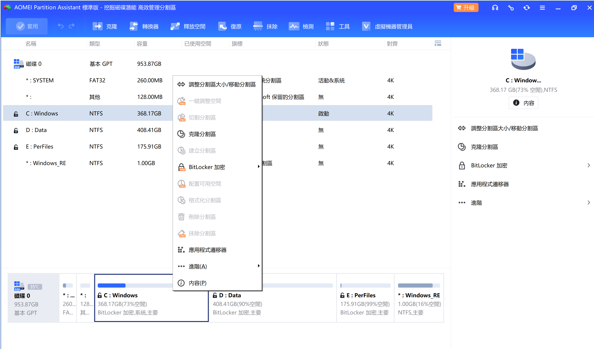
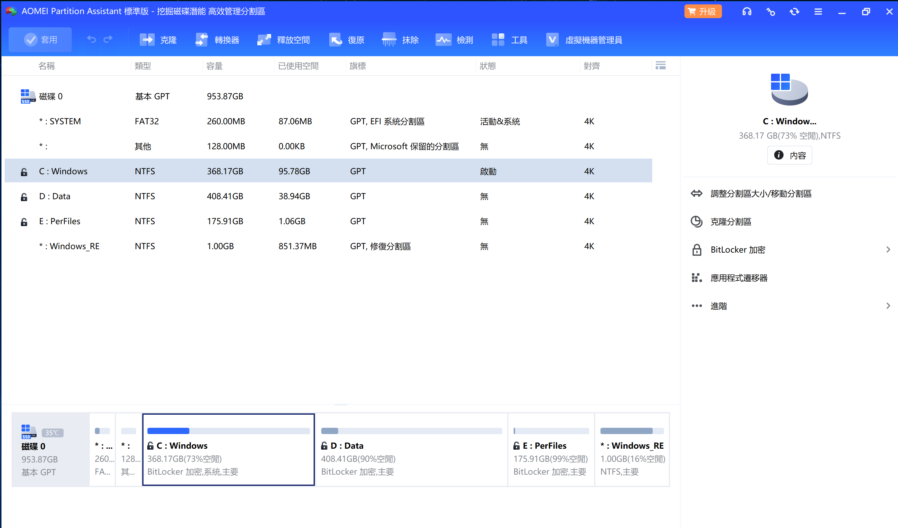
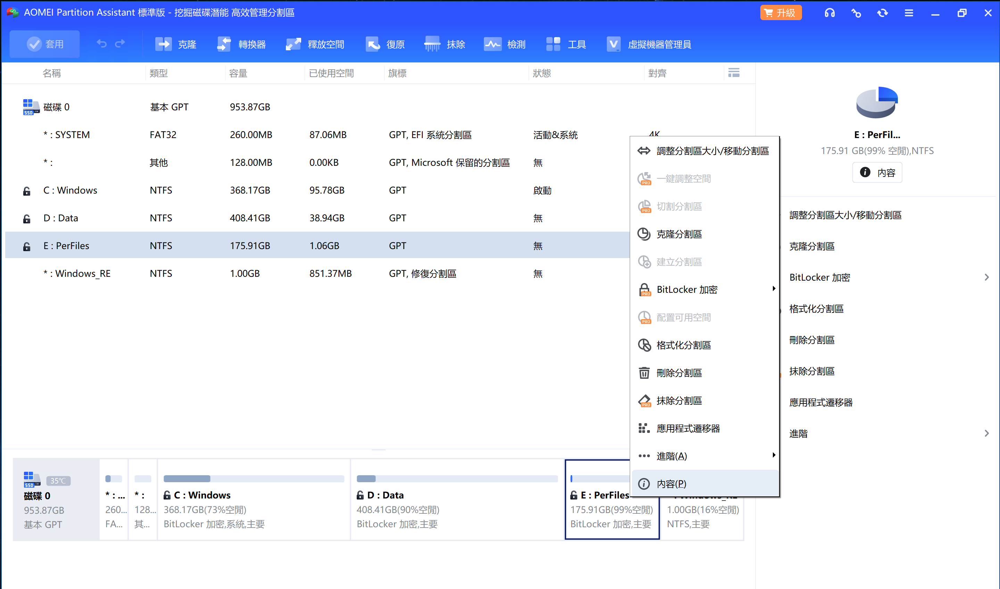
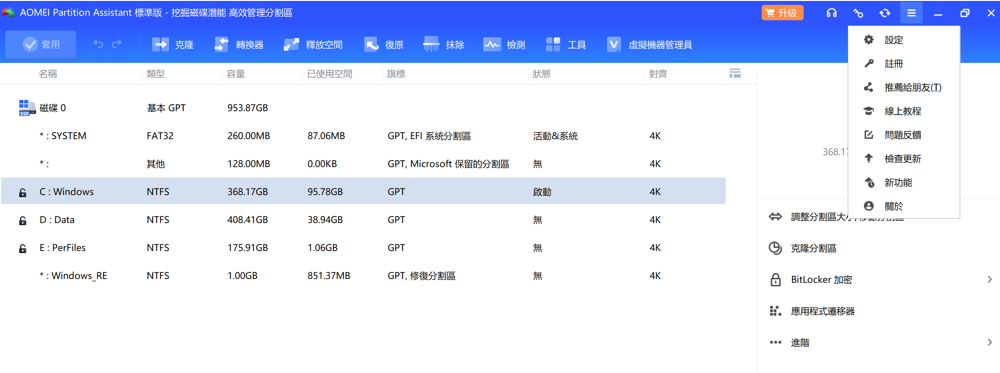

# 🚀 C 盘扩容实战指南

> 删除废弃 F 盘，把 173GB 未分配空间合并到 C 盘，让系统盘从 195GB 飙到 368GB —— 顺便搞定 BitLocker 加密恢复。
>
> **实际案例** · **踩坑记录** · **AI 能力边界分析**

---

## 先看成果

```
操作前：  [C: 195GB ████████░░░░░░░░]  [D: 408GB]  [E: 176GB]  [F: 173GB]
操作后：  [C: 368GB ████████████████░]  [D: 408GB]  [E: 176GB]
```

C 盘从红色预警（仅剩几十 GB）变成宽裕的 368GB，再也不用天天清缓存、删文件、焦虑磁盘空间了。

---

## 为什么写这份指南

Windows 自带磁盘管理有个致命限制：**无法移动分区**。如果你的 C 盘和未分配空间之间隔着其他分区（比如 D 盘、E 盘），Windows 原生工具完全帮不了你。

本指南记录了用 **QoderWork AI 助手 + AOMEI 第三方分区工具** 完成 C 盘扩容的完整流程。更重要的是，它记录了 **AI 自动化在哪里失败、为什么失败、以及正确的分工方式**，让你不必在同样的坑里反复跌倒。

---

## ⚠️ 免责声明（请务必阅读）

**磁盘分区操作有风险。** 本指南所有内容基于作者的实际操作经验撰写，并已经过完整验证。但不同电脑的硬件配置、磁盘布局、操作系统版本和软件环境存在差异，**不保证本指南中的步骤在您的电脑上一定安全无虞**。

执行本指南中的任何操作前，您必须：

- **完整阅读** 本文档的所有步骤和注意事项，不要跳读
- **备份所有重要数据** 到外部硬盘或云存储。分区一旦删除、格式化或损坏，数据极可能无法恢复
- **确认 F 盘（或您要删除的目标分区）数据为空或已妥善备份**，反复检查两遍以上
- **确认电脑接通电源**（笔记本），避免操作中断电
- **理解每一步操作的含义**，如果您对某个步骤不确定，请先查阅相关资料或咨询有经验的人

**作者及工具提供方对因使用本指南导致的任何数据丢失、系统损坏、硬盘故障等后果不承担任何责任。** 您按照本指南操作即视为已充分理解并自愿承担所有风险。

> 💡 如果您只是想让 C 盘多一点空间，而非必须合并某个已删除的分区，建议优先考虑更安全的方式（如清理临时文件、移动个人文件到其他盘、使用 Windows 自带的磁盘清理工具等）。

---

## 工具清单

| 工具 | 角色 | 收费 |
|------|------|------|
| **QoderWork CN（User 版）** | AI 桌面助手，负责命令行操作（磁盘检查、删除分区、BitLocker 管理） | 内置于 Qoder 桌面应用 |
| **AOMEI Partition Assistant 标准版** | 第三方磁盘分区工具，手动拖拽移动/扩展分区 | 免费 |
| **Windows diskpart** | 删除分区 | 系统自带 |
| **Windows manage-bde** | BitLocker 加密管理 | 系统自带 |

> ⚠️ **QoderWork 是 Qoder 桌面应用的核心功能模块**，本次使用的是用户版（User Edition）。如果你还没有安装，可以在 [Qoder 官网](https://qoder.com) 下载。

---

## 操作流程总览

```
┌─────────┐    ┌─────────┐    ┌─────────┐    ┌──────────┐    ┌──────────┐
│ ① 删除   │ → │ ② 移动   │ → │ ③ 移动   │ → │ ④ 扩展   │ → │ ⑤ 套用   │
│   F 盘    │   │   E 盘   │   │   D 盘   │   │   C 盘   │   │  重启    │
└─────────┘    └─────────┘    └─────────┘    └──────────┘    └──────────┘
  AI 命令行      👤 手动拖拽     👤 手动拖拽     👤 手动拖拽      👤 手动点击
```

五个步骤中，**AI 只负责第一步的命令行操作**，其余拖拽分区、点击套用按钮，全部由你手动操作。这不是因为 AI 偷懒 —— 继续往下看你就知道为什么。

---

## 详细步骤

### 准备工作：检查磁盘布局

```powershell
# 以管理员权限运行 PowerShell
Get-Partition -DiskNumber 0 | Format-Table PartitionNumber, DriveLetter, @{N="SizeGB";E={[math]::Round($_.Size/1GB,1)}}, Type
```

确认分区排列顺序，这一步决定了后续移动分区的方向。

### 准备工作：暂停 BitLocker 保护

```powershell
manage-bde -status                  # 先看状态
manage-bde -protectors -disable C:  # 暂停保护
manage-bde -protectors -disable D:
manage-bde -protectors -disable E:
```

> 🚨 **必须暂停 BitLocker！** 如果保护开着就去动分区，可能导致整个分区无法读取。

### 准备工作：确认 F 盘数据为空

```powershell
Get-Volume -DriveLetter F | Format-List
```

**反复确认 F 盘没有需要保留的数据**。分区一旦删除，数据不可恢复。

---

### 步骤 ①：删除 F 盘（AI 负责）

使用 diskpart 删除目标分区，空间变为「未分配」：

```powershell
@"
select disk 0
list partition
select partition <目标分区号>
delete partition override
"@ | Out-File -FilePath delete_partition.txt -Encoding ASCII

Start-Process diskpart -ArgumentList "/s $PWD\delete_partition.txt" -Verb RunAs -Wait
```

> 🚨 **危险操作确认清单**：F 盘数据已空 ✓ 分区号正确 ✓ 用户明确同意 ✓

完成后磁盘布局：

```
[C: 195GB] [D: 408GB] [E: 176GB] [未分配 173GB] [恢复 1GB]
```

> C 盘与未分配空间之间隔着 D 盘和 E 盘，无法直接扩展。需要把 D、E 逐个向右推。

---

### 步骤 ②~④：手动拖拽分区（你负责）

AOMEI 界面操作，三步走：

**先推 E 盘**：右键 E 盘 → 「调整/移动分区」→ 把分区块拖到最右边 → 确定



**再推 D 盘**：右键 D 盘 → 「调整/移动分区」→ 把分区块拖到最右边 → 确定

**最后扩 C 盘**：右键 C 盘 → 「调整/移动分区」→ 把右侧边界拖到最右 → 确定



> C 盘应该从 195GB 变为约 368GB。

---

### 为什么这些步骤不能让 AI 自动操作？

**实战结论：AOMEI 的图形界面 AI 无法可靠自动化。**

我们浪费了大量时间用各种方式尝试：pywinauto（窗口检测失败）、SendInput 鼠标模拟（管理员权限隔离导致 SetCursorPos 无效）、UIAutomation COM（拒绝加载）、屏幕坐标计算（200% DPI 下反复偏差）、右键菜单检测（MFC 自定义绘制无法被程序感知）。全部宣告失败。

**AI 在尝试自动化移动 E 盘时陷入了崩溃和死循环**，消耗了大量 Token 却毫无进展。

**正确分工**：AI 负责命令行（磁盘检查、删除分区、恢复 BitLocker），GUI 拖拽由你花 3 分钟手动完成。分工明确，各自做各自擅长的。

---

### 步骤 ⑤：套用 → 执行 → 重启（最关键！）

所有拖拽操作只是「排队」，还没有实际修改磁盘。必须：

1. **点击顶部工具栏的「套用」按钮**（绿色勾号 ✓）


2. 弹出确认对话框后，检查操作列表无误，点击「执行」



3. 系统提示需要重启，点击「确认重启」

> **「套用」→「执行」→「重启」三步缺一不可。只拖拽不点套用 = 什么都没做。**

重启后 AOMEI 在 PreOS 模式（Windows 启动前）自动执行。屏幕会显示进度条，整个过程约 **10~30 分钟**。

---

## 重启后：恢复 BitLocker 加密

分区操作完成后 BitLocker 保护处于关闭状态，需要重新启用：

```powershell
# 确认状态
manage-bde -status

# 启用保护器
manage-bde -protectors -enable C:
manage-bde -protectors -enable D:
manage-bde -protectors -enable E:

# 数据盘开启自动解锁（系统登录后自动解密）
manage-bde -autounlock -enable D:
manage-bde -autounlock -enable E:

# 再次验证
manage-bde -status
```

目标状态：所有盘「保护状态: 保护已启用 ✓」「锁定状态: 已解锁」「自动解锁: 已启用」。

> GUI 方式备选：Win+R 输入 `control /name Microsoft.BitLockerDriveEncryption` 打开 BitLocker 控制面板手动操作。

---

## 语言设置

AOMEI 安装后默认界面为繁体中文：

1. 点击右上角 **三条横线菜单（☰）**
2. 选择「**設定**」（设置）图标
3. 在语言选项中查找中文



> **注意**：目前仅提供**繁体中文**，不提供简体中文选项。繁体用词差异一览：「套用」= 应用、「調整」= 调整、「分割區」= 分区。操作流程完全一致，不影响使用。

---

## 注意事项（逐条确认）

1. **F 盘数据必须为空** —— 删除前反复检查，删了就是删了
2. **BitLocker 要先解密打开，操作完再重新加密** —— 这是 BitLocker 的完整生命周期，不能跳过
3. **分区拖拽必须手动，不要让 AI 自动化** —— 我们已经替你踩过了所有的坑
4. **笔记本接通电源** —— 断电可能导致分区损坏
5. **PreOS 执行期间不要强制关机** —— 耐心等进度条跑完
6. **「套用」按钮必须点击** —— 这不是可选的，是唯一的提交方式
7. **BitLocker 恢复密钥务必妥善保存** —— 存在微软账户里或打印出来，关键时刻是救命稻草
8. **本次只扩展 C 盘右侧边界，不移动 C 盘起始位置** —— 这降低了操作风险

---

## 常见问题

| 问题 | 解决方法 |
|------|----------|
| 忘了点「套用」就重启了？ | 分区没有被修改，回到 AOMEI 重新操作即可 |
| 排错操作了？ | AOMEI 中按 Ctrl+Z 撤销，或点击「撤销」按钮 |
| 分区移动后 Windows 无法启动？ | Windows 恢复环境 → `bootrec /fixmbr` + `bootrec /fixboot` |
| BitLocker 提示输入恢复密钥？ | 使用 48 位恢复密钥（在 Microsoft 账户中查找） |
| manage-bde 提示拒绝访问？ | 以管理员权限运行 PowerShell |
| 保护器显示「找不到」？ | 先添加：`manage-bde -protectors -add D: -recoverypassword` |
| AOMEI 提示需要付费版？ | 标准版足够使用，如果某个功能被限制，试试 DiskGenius 或 MiniTool Partition Wizard |

---

## 替代工具

如果 AOMEI 因为某些原因不能使用，以下工具同样支持分区移动：

- **DiskGenius**：www.diskgenius.com
- **MiniTool Partition Wizard**：www.partitionwizard.com

操作方式基本一致：右键分区 → 移动 → 拖拽 → 应用。

---

## 工具信息

| 工具 | 版本 | 说明 |
|------|------|------|
| QoderWork CN | User 版 | AI 桌面助手，Qoder 桌面应用的核心功能模块 |
| AOMEI Partition Assistant | Standard Edition | 第三方磁盘分区工具，免费版即可完成本操作 |
| Windows diskpart | 系统自带 | 磁盘分区命令行工具 |
| Windows manage-bde | 系统自带 | BitLocker 驱动器加密管理工具 |

---

> 🤖 本指南由 QoderWork 辅助生成 · 所有步骤均经过实际操作验证 · 2026 年 6 月
