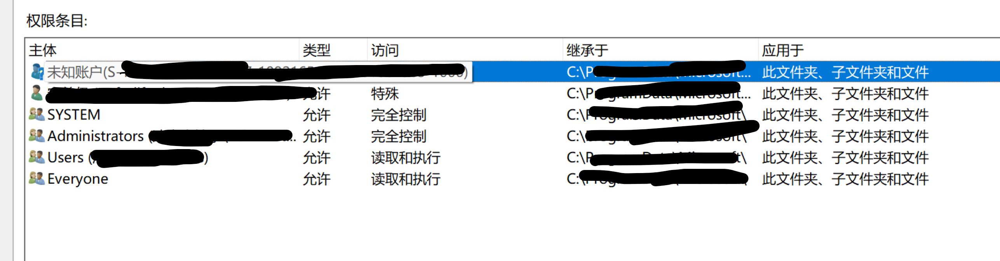

# Windows 清除残留/未知账户 SID 操作指南

> 适用场景：在文件或文件夹的「安全」属性中发现「未知账户(S-1-5-21-xxx)」，需要彻底清除该账户在系统中所有残留权限和痕迹。
>
> 本次实际操作：清除 `S-1-5-21-1482809247-1092165676-3601881385-1000`，存在于 `C:\ProgramData\Microsoft\Windows\Start Menu`。

## 背景知识

### 什么是 SID

SID（Security Identifier）是 Windows 为每个用户、组、计算机账户分配的唯一标识符。格式如 `S-1-5-21-<域ID>-<RID>`。当用户账户被删除后，其 SID 可能在文件 ACL 中残留，显示为「未知账户」。



> 上图中第一行即为「未知账户」，下方其他账户信息已做模糊处理。这种情况常见于系统重装后或删除用户后权限未清理。

### 常见来源

- 系统重装或重置后，旧用户账户的 SID 残留在非系统盘
- 某软件安装时创建的临时账户未清理
- 域环境切换后的失效域账户
- 预览版或 Insider 版本升级后的孤儿 SID

### 不清除有什么影响

一般不影响正常使用，但：
- 权限列表冗余，查看时干扰视线
- 某些安全审计工具会将其标记为风险项
- 极少数情况下可能导致权限继承异常

---

## 使用工具

| 工具 | 说明 |
|------|------|
| AI 桌面助手 | 负责编写和执行扫描/清除脚本 |
| **PowerShell Get-Acl / Set-Acl** | 读取和修改文件 ACL |
| **icacls** | Windows 自带权限管理命令行工具，支持 `/findsid` 递归扫描 |
| **regedit / Get-ChildItem** | 注册表残留检查 |

---

## 操作流程总览

```
┌──────────┐    ┌──────────┐    ┌──────────┐    ┌──────────┐
│ ① 识别   │ → │ ② 全面   │ → │ ③ 逐项   │ → │ ④ 验证   │
│  目标SID  │   │  扫描    │   │  清除    │   │  无残留   │
└──────────┘    └──────────┘    └──────────┘    └──────────┘
```

---

## 第一步：识别目标 SID

### 1.1 从「未知账户」获取 SID

在要清理的文件夹上右键 → 属性 → 安全 → 选中「未知账户」→ 高级，可以看到完整 SID。

或者在 PowerShell 中：

```powershell
$path = "C:\ProgramData\Microsoft\Windows\Start Menu"
$acl = Get-Acl $path
$acl.Access | Where-Object { $_.IdentityReference.Value -like '*S-1-5-21*' } | ForEach-Object { $_.IdentityReference.Value }
```

### 1.2 尝试解析 SID

```powershell
$sid = 'S-1-5-21-1482809247-1092165676-3601881385-1000'
try {
    $obj = New-Object System.Security.Principal.SecurityIdentifier($sid)
    $name = $obj.Translate([System.Security.Principal.NTAccount])
    Write-Host "Resolved: $name"
} catch {
    Write-Host "Cannot resolve - user already deleted"
}
```

如果无法解析，说明这是一个孤儿 SID，可以安全清除。

### 1.3 确认用户是否仍存在

```powershell
# 检查 ProfileList 注册表
$profilePath = "HKLM:\SOFTWARE\Microsoft\Windows NT\CurrentVersion\ProfileList\$sid"
if (Test-Path $profilePath) {
    Write-Host "User profile still exists in registry! Do NOT delete the SID."
} else {
    Write-Host "No profile - SID is safe to remove."
}
```

---

## 第二步：全面扫描

### 2.1 扫描文件系统（推荐方案）

使用 `icacls /findsid` 递归扫描关键目录。这是最可靠的检测方式：

```powershell
$sid = 'S-1-5-21-1482809247-1092165676-3601881385-1000'
$keyPaths = @("C:\ProgramData", "C:\Users", "C:\Windows")

foreach ($kp in $keyPaths) {
    Write-Host "Scanning $kp ..."
    icacls $kp /t /c /findsid $sid
}
```

> `/t` 递归子目录，`/c` 遇错继续（防止权限不足中断），`/findsid` 按 SID 精确查找。

### 2.2 扫描文件系统（PowerShell 方式，备选）

当 `icacls /findsid` 不可用时（部分早期 Win10），用以下脚本：

```powershell
$sid = 'S-1-5-21-1482809247-1092165676-3601881385-1000'
$scanPaths = @(
    "C:\ProgramData",
    "C:\Users",
    "C:\Windows\Temp",
    "C:\Program Files",
    "C:\Program Files (x86)",
    "C:\"
)

foreach ($basePath in $scanPaths) {
    if (-not (Test-Path $basePath)) { continue }
    Write-Host "Scanning $basePath ..."
    Get-ChildItem $basePath -Directory -Depth 3 -ErrorAction SilentlyContinue | ForEach-Object {
        try {
            $acl = Get-Acl $_.FullName -ErrorAction Stop
            foreach ($ace in $acl.Access) {
                if ($ace.IdentityReference.Value -eq $sid) {
                    Write-Host "  [FOUND] $($_.FullName)"
                    Write-Host "    Type: $($ace.AccessControlType) | Rights: $($ace.FileSystemRights) | Inherited: $($ace.IsInherited)"
                }
            }
        } catch {}
    }
}
```

> `-Depth 3` 可调整。深度越大扫描越全但耗时越长。优先扫描 `C:\ProgramData` 和 `C:\Users`，这两个位置是孤儿 SID 最常出现的地方。

### 2.3 检查 SID 命名的残留文件夹

有时文件夹直接以 SID 命名（如 `C:\Users\S-1-5-21-xxx`）：

```powershell
Get-ChildItem C:\Users -Directory -Force -ErrorAction SilentlyContinue | Where-Object { $_.Name -like 'S-1-5-21-*' }
Get-ChildItem C:\ProgramData -Directory -Force -ErrorAction SilentlyContinue | Where-Object { $_.Name -like 'S-1-5-21-*' }
```

### 2.4 检查注册表

```powershell
$sid = 'S-1-5-21-1482809247-1092165676-3601881385-1000'

# ProfileList
$profilePath = "HKLM:\SOFTWARE\Microsoft\Windows NT\CurrentVersion\ProfileList\$sid"
if (Test-Path $profilePath) { Write-Host "FOUND in ProfileList" }

# ProfileGuid
$guidPath = "HKLM:\SOFTWARE\Microsoft\Windows NT\CurrentVersion\ProfileGuid"
Get-ChildItem $guidPath -ErrorAction SilentlyContinue | Where-Object { $_.PSChildName -eq $sid } | ForEach-Object { Write-Host "FOUND in ProfileGuid" }
```

### 2.5 检查计划任务和服务

```powershell
$sid = 'S-1-5-21-1482809247-1092165676-3601881385-1000'

# 计划任务
$tasks = Get-ScheduledTask -ErrorAction SilentlyContinue
$tasks | Where-Object { $_.Principal.UserId -eq $sid } | ForEach-Object { Write-Host "Task: $($_.TaskName)" }

# Windows 服务
Get-WmiObject Win32_Service -ErrorAction SilentlyContinue | Where-Object { $_.StartName -match '1482809247' } | ForEach-Object { Write-Host "Service: $($_.Name) runs as $($_.StartName)" }
```

---

## 第三步：清除

### 3.1 从 ACL 中移除（核心操作）

```powershell
$sid = 'S-1-5-21-1482809247-1092165676-3601881385-1000'

function Remove-SidFromPath {
    param($path)
    try {
        $acl = Get-Acl $path -ErrorAction Stop
        $matches = $acl.Access | Where-Object { $_.IdentityReference.Value -eq $sid }
        if (-not $matches) { return }
        foreach ($ace in $matches) {
            Write-Host "  Removing from $path : $($ace.FileSystemRights)"
            $acl.RemoveAccessRule($ace) | Out-Null
        }
        Set-Acl $path $acl
        Write-Host "  [DONE] $path"
    } catch {
        Write-Host "  [ERROR] $path : $_"
    }
}

# 逐个清除扫描到的路径
Remove-SidFromPath 'C:\ProgramData\Microsoft\Windows\Start Menu'
```

### 3.2 删除 SID 命名的文件夹（如有）

```powershell
$sidFolder = Get-ChildItem C:\Users -Directory -Force -ErrorAction SilentlyContinue | Where-Object { $_.Name -eq $sid }
if ($sidFolder) {
    Remove-Item $sidFolder.FullName -Recurse -Force
    Write-Host "Removed folder: $($sidFolder.FullName)"
}
```

### 3.3 删除注册表 ProfileList 条目（如有）

```powershell
$profilePath = "HKLM:\SOFTWARE\Microsoft\Windows NT\CurrentVersion\ProfileList\$sid"
if (Test-Path $profilePath) {
    Remove-Item $profilePath -Force
    Write-Host "Removed registry: $profilePath"
}
```

---

## 第四步：验证

清除后必须逐个确认无残留：

```powershell
$sid = 'S-1-5-21-1482809247-1092165676-3601881385-1000'

# 复查原位置
$acl = Get-Acl 'C:\ProgramData\Microsoft\Windows\Start Menu'
$found = $acl.Access | Where-Object { $_.IdentityReference.Value -eq $sid }
if ($found) {
    Write-Host "ERROR: SID still present!"
} else {
    Write-Host "OK: SID removed from Start Menu"
}

# 再次 icacls 全局扫描确认
icacls C:\ProgramData /t /c /findsid $sid
icacls C:\Users /t /c /findsid $sid
```

---

## 注意事项

1. **操作前确认 SID 对应的用户已被删除** —— 检查 ProfileList 注册表（`HKLM:\SOFTWARE\Microsoft\Windows NT\CurrentVersion\ProfileList\<SID>`），如果 ProfileImagePath 仍指向有效目录，说明用户仍存在，不要清除其 SID
2. **只清除「允许」和「特殊」类型的权限条目** —— 如果是「拒绝」类型，可能是安全策略刻意设置，删除前需确认用途
3. **系统关键目录的权限（如 `C:\Windows`、`C:\Program Files`）谨慎处理** —— 本次操作中实际上只有 `C:\ProgramData\Microsoft\Windows\Start Menu` 残留，属于非关键权限
4. **继承的权限（IsInherited=True）** —— 如果 SID 是从父目录继承来的，只清除子目录不会生效，需要从继承源头（父目录）清除
5. **管理员权限必需** —— `Get-Acl`、`Set-Acl`、`icacls /findsid` 均需以管理员运行。部分受保护目录（如 `C:\ProgramData\Microsoft\Windows\SystemData`）非管理员连读取 ACL 都做不到
6. **操作后无需重启** —— ACL 修改即时生效，不影响系统运行
7. **备份重要数据** —— 虽然清除孤儿 SID 一般不会导致问题，但修改 ACL 始终有风险，建议操作前创建系统还原点

---

## 经验总结

### AI 擅长的部分

- 编写和执行扫描脚本（PowerShell Get-Acl + 枚举）
- 批量搜索和替换 ACL 条目
- 跨注册表、任务计划、服务的全面扫描
- 生成报告和日志

### 需要人工判断的部分

- 确认该 SID 是否真的「废弃」而非仍在使用（检查 ProfileList、服务账户）
- 决定是否清除特定位置的「拒绝」类型权限条目
- 处理权限不足、无法读取 ACL 的系统保护目录

---

## 工具信息

| 工具 | 版本 | 说明 |
|------|------|------|
| Windows PowerShell | 5.1+ | 系统自带，用于 ACL 操作和注册表扫描 |
| icacls | 系统自带 | Windows ACL 管理命令行工具 |

---

> 🤖 由 AI 辅助生成 · 基于实际清除操作验证 · 2026.06
